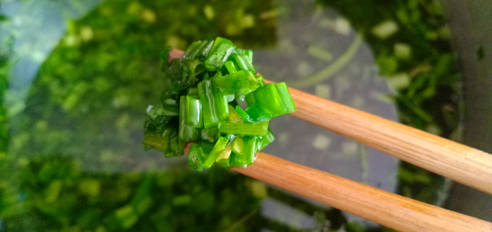

{ width=50% }

## Table of contents
* [General info](#general-info)
* [Technologies](#technologies)
* [Setup](#setup)

## General info
This project is SHOKUREN Management.
	
## Technologies
Project is created with:
* Laravel: 5.5
* PHP >= 7.0
* Ubuntu 16.04
* laravel-mix
* cross-env
* sass
* sass-loader
* axios
* bootstrap
* inputmask
* jquery
* lodash
* animate
* izitoast
* moment
* numeral
* qs
* sweetalert2
* tiny-date-picker
* fortawesome
* material-design-icons
* bootstrap-daterangepicker
	
## Setup
To run this project, install it locally using npm, composer, php artisan:

```
$ cd ../shokuren
$ composer install
$ npm install
$ npm run prod
$ php artisan migrate --seed
$ php artisan config:clear
$ php artisan route:cache
$ php artisan view:clear
```
